# End-to-end factory workflow

**Status:** Owner-review working document  
**Owner input captured:** 02-Sep-2026  
**Repository verification:** 02-Sep-2026  

This is the single owner-readable map of the factory workflow. It combines repeated
references to the same page or activity into one place. It is not a factory decision
record. A requirement becomes binding only when it is recorded through the factory
decision system.

## Reading rule

- **VERIFIED** means the current code or an active decision supports the statement.
- **GAP** means the current application does not yet match the required workflow.
- **OPEN** means the owner or Accounts must still choose the exact rule.
- **REQUIRED** means the owner stated the desired factory behaviour on 02-Sep-2026,
  but it has not yet been converted into an immutable decision record.

## Complete workflow

```mermaid
flowchart LR
    roleLogin(["User signs in"]) --> roleDashboard["Role dashboard and action queue"]

    subgraph procurement ["Procurement"]
        purchaseNeed["Material need"] --> requisition["Purchase requisition"]
        requisition --> requisitionApproval{"Approved by authorised person?"}
        requisitionApproval -->|"No"| rejectedRequest["Return or reject"]
        requisitionApproval -->|"Yes"| purchaseOrder["Purchase order"]
        purchaseOrder --> deliverySchedule["Delivery schedule"]
        deliverySchedule --> goodsReceipt["Partial or full GRN"]
        goodsReceipt --> incomingInspection["Incoming inspection"]
        incomingInspection -->|"Accepted"| usableMaterial["Usable material stock"]
        incomingInspection -->|"Rejected"| rejectedMaterial["Rejected material control"]
        goodsReceipt --> supplierBill["Supplier bill recorded by Accounts"]
    end

    subgraph inventory ["Store and inventory"]
        usableMaterial --> barcodeLabels["Bag or lot labels"]
        usableMaterial --> storeStock["Single operational Store"]
        storeStock --> storeProduction["Store issues material to Production"]
        storeStock --> salesHold["Hold finished goods for a sales order"]
    end

    subgraph production ["Production"]
        storeProduction --> productionPlan["Capacity and completion estimate"]
        productionPlan --> productionQueue["Production queue"]
        productionQueue --> startBatch["Start batch"]
        startBatch --> recordRun["Output, consumption, exceptions and downtime"]
        recordRun --> completeBatch["Complete batch"]
        completeBatch --> productionQuality["Production quality checklist"]
        productionQuality --> productionApproval["Plant Manager and Accounts approvals"]
        productionApproval --> finishedStock["Finished goods stock"]
    end

    subgraph sales ["Sales and dispatch"]
        salesOrder["Sales order"] --> stockAvailable{"Finished goods available?"}
        stockAvailable -->|"Yes"| salesHold
        stockAvailable -->|"No"| productionRequest["Send shortage to Production"]
        productionRequest --> productionPlan
        finishedStock --> salesHold
        salesHold --> dispatchQuality["Internal Quality approval"]
        dispatchQuality --> storeDispatch["Store dispatches"]
        storeDispatch --> deliveryComplete["Delivery recorded and ERP stock reduced"]
    end

    subgraph tally ["Tally and reports"]
        purchaseOrder -.-> tallyPurchaseOrder["Tally Purchase Order"]
        productionApproval -.-> tallyStockJournal["Tally Stock Journal"]
        deliveryComplete --> tallySalesInvoice["Tally creates Sales Invoice"]
        tallySalesInvoice --> importSalesInvoice["ERP imports and matches invoice"]
        tallyStockJournal --> reconciliation["Reports and reconciliation"]
        importSalesInvoice --> reconciliation
    end

    roleDashboard --> purchaseNeed
    roleDashboard --> incomingInspection
    roleDashboard --> storeProduction
    roleDashboard --> productionPlan
    roleDashboard --> salesOrder
```

The dotted Tally arrows mean a separate integration action. They do not mean the
browser talks directly to Tally. The local Tally Agent is the integration boundary.

## Role dashboard requirement

The Dashboard is not only for Admin. Every role must land on work that belongs to
that role.

| Role | Dashboard must answer |
|---|---|
| Store | What was requested, what must be issued, what is waiting for QC, what sales stock is held, and what is ready to dispatch? |
| Procurement | What requisitions need action, what approved requests need a PO, what POs are due, and what deliveries are short or late? |
| Quality | What incoming material and finished goods need inspection or approval? |
| Production | What is queued, what can start, what is running, what is down, and what is waiting for completion? |
| Plant Manager | What requires operational approval, and where is production delayed? |
| Accounts | What supplier bills, production approvals, Tally failures, and finance reviews need action? |
| Sales | What orders are covered by stock, what needs production, what is awaiting dispatch, and what Tally invoices matched? |
| Admin or Owner | Cross-factory summary, exceptions, overdue work, and drill-down to every role queue. |

The dashboard may show only actions the signed-in person is permitted to perform.
It should deep-link to the exact filtered rows behind every count.

## Verification tracker

| Chapter | Current result | Detailed document |
|---|---|---|
| Dashboard and Procurement | Verified on 02-Sep-2026; several workflow gaps found | [01-DASHBOARD-AND-PROCUREMENT.md](01-DASHBOARD-AND-PROCUREMENT.md) |
| Quality, Inventory and Production | Capture resumed 02-Sep-2026; Store-scan-at-issue rule recorded as DEC-20260902-002; Q94 opened; code verification pending | [02-QUALITY-INVENTORY-PRODUCTION.md](02-QUALITY-INVENTORY-PRODUCTION.md) |
| Sales and Dispatch | Active decisions found; full page verification pending | To be created |
| Reports and Tally | Direction captured; report-by-report reconciliation pending | To be created |

## Owner input still continuing

The 02-Sep-2026 explanation ended while describing the finished-goods Quality
checklist and Product Configuration standards. That section must be continued before
the Production Quality chapter is treated as complete.

