# End-to-end factory workflow

**Status:** Owner-review working document  
**Owner input captured:** 02-Sep-2026  
**Repository verification:** 02-Sep-2026  

This is the single owner-readable map of the factory workflow. It combines repeated
references to the same page or activity into one place. It is not a factory decision
record. A requirement becomes binding only when it is recorded through the factory
decision system.

## Reading rule

- **VERIFIED** means the current code or an active decision supports the statement.
- **GAP** means the current application does not yet match the required workflow.
- **OPEN** means the owner or Accounts must still choose the exact rule.
- **REQUIRED** means the owner stated the desired factory behaviour on 02-Sep-2026,
  but it has not yet been converted into an immutable decision record.

## Complete workflow

```mermaid
flowchart LR
    roleLogin(["User signs in"]) --> roleDashboard["Role dashboard and action queue"]

    subgraph procurement ["Procurement"]
        purchaseNeed["Material need"] --> requisition["Purchase requisition"]
        requisition --> requisitionApproval{"Approved by a different procurement user?"}
        requisitionApproval -->|"Rejected by approver"| rejectedRequest["Rejected"]
        requisition -->|"Requester withdraws"| withdrawnRequest["Withdrawn"]
        requisitionApproval -->|"Yes"| purchaseOrder["Purchase order (PO first, always)"]
        purchaseOrder --> deliverySchedule["Delivery schedule"]
        deliverySchedule --> goodsReceipt["Partial or full GRN"]
        goodsReceipt --> labels["Bag labels (weighed) or handling-unit labels (counted)"]
        goodsReceipt --> qcHold["Held for incoming Quality (every arrival)"]
        qcHold --> incomingInspection["Incoming inspection: whole bags or units"]
        incomingInspection -->|"Accepted"| usableMaterial["Usable material stock"]
        incomingInspection -->|"Rejected"| rejectionsOut["Rejections Out issue"]
        rejectionsOut -.-> supplierBill["Supplier bill: rejected qty and reference shown"]
        goodsReceipt --> supplierBill
    end

    subgraph inventory ["Store and inventory"]
        usableMaterial --> storeStock["Single operational Store"]
        storeStock --> storeIssue["Store Issue: Store scans the bag once"]
        storeIssue --> productionWip["Production/WIP (the day bin for PET resin)"]
        productionWip -->|"End of day, non-bin material still in its container"| storeStock
        productionWip -->|"Damaged non-bin material"| qualityHold["Quality hold"]
        storeStock --> salesHold["Hold finished goods for a sales order"]
    end

    subgraph production ["Production"]
        productionRequest["Production request"] --> productionQueue["Queue: promised date first, manual position sticks"]
        productionQueue --> productionPlan["Completion estimate: ceiling, one machine"]
        productionQueue --> startBatch["Start batch: readiness gate, packaging, override reason"]
        productionWip --> startBatch
        startBatch --> recordRun["Output, consumption, exceptions and downtime"]
        recordRun --> completeBatch["Complete batch: variance shown"]
        completeBatch --> finishedStock["Finished goods in the Store: Quality-pending until the batch check"]
        completeBatch --> productionQuality["Quality: checklist beside the OK/rejected count"]
        productionQuality --> pmApproval["Plant Manager approval (not the checker)"]
        pmApproval --> accountsApproval["Accounts approval (not the PM; postable voucher)"]
    end

    subgraph sales ["Sales and dispatch"]
        salesOrder["Sales order: finished goods only"] --> stockAvailable{"Finished goods available?"}
        stockAvailable -->|"Yes"| salesHold
        stockAvailable -->|"No"| productionRequest
        finishedStock --> salesHold
        salesHold --> dispatchQuality["Internal Quality approval"]
        dispatchQuality --> storeDispatch["Store dispatches by carton scan (typed only for legacy stock)"]
        storeDispatch --> deliveryComplete["Delivery recorded and ERP stock reduced"]
    end

    subgraph tally ["Tally and reports"]
        purchaseOrder -.-> tallyPurchaseOrder["Tally Purchase Order"]
        accountsApproval -.-> tallyStockJournal["Tally Stock Journal, one per shift"]
        deliveryComplete --> tallySalesInvoice["Tally creates Sales Invoice"]
        tallySalesInvoice --> importSalesInvoice["Accounts imports; ERP matches confirmed orders; unmatched resolved by Accounts"]
        tallyStockJournal --> reconciliation["Reports and reconciliation"]
        importSalesInvoice --> reconciliation
    end

    roleDashboard --> purchaseNeed
    roleDashboard --> incomingInspection
    roleDashboard --> storeIssue
    roleDashboard --> productionQueue
    roleDashboard --> salesOrder
```

The dotted Tally arrows mean a separate integration action. They do not mean the
browser talks directly to Tally. The local Tally Agent is the integration boundary.
Redrawn 02-Sep-2026 to the factory DEC-20260902-002 to -035 define; the earlier
drawing hung finished goods off approval and showed no scan, no day bin, no
return, no hold for counted material and no queue order.

## Role dashboard requirement

The Dashboard is not only for Admin. Every role must land on work that belongs to
that role.

| Role | Dashboard must answer |
|---|---|
| Store | What was requested, what must be issued, what is waiting for QC, what finished goods are completed, Quality-pending, approved and rejected, what sales stock is held, and what is ready to dispatch? |
| Procurement | What requisitions need action, what approved requests need a PO, what POs are due, and what deliveries are short or late? |
| Quality | What incoming material and finished goods need inspection or approval? |
| Production | What is queued, what can start, what is running, what is down, and what is waiting for completion? |
| Plant Manager | What requires operational approval, and where is production delayed? |
| Accounts | What supplier bills, production approvals, Tally failures, and finance reviews need action? |
| Sales | What orders are covered by stock, what needs production, what is awaiting dispatch, and what Tally invoices matched? |
| Admin or Owner | Cross-factory summary, exceptions, overdue work, and drill-down to every role queue. |

The dashboard may show only actions the signed-in person is permitted to perform.
It should deep-link to the exact filtered rows behind every count.

## Verification tracker

| Chapter | Current result | Detailed document |
|---|---|---|
| Dashboard and Procurement | Verified on 02-Sep-2026; several workflow gaps found | [01-DASHBOARD-AND-PROCUREMENT.md](01-DASHBOARD-AND-PROCUREMENT.md) |
| Quality, Inventory and Production | Complete 02-Sep-2026: 39 decisions recorded (DEC-20260902-002 to -040, after an Opus review whose five questions were answered the same day) covering the Store scan, the day bin, returns, both Quality checklists, handling units, the approval chain's gates, packaging, factory rules, variance, held stock and the production queue; Q45, Q59, Q62, Q64, Q78, Q87, Q90, Q93, Q94 closed; ground-truth research note under `research/` | [02-QUALITY-INVENTORY-PRODUCTION.md](02-QUALITY-INVENTORY-PRODUCTION.md) |
| Sales and Dispatch | Complete 02-Sep-2026: walkthrough confirmed the flow in force; 12 decisions recorded (DEC-20260902-041 to -052); Q37, Q67, Q73 closed; ground-truth note under `research/` | [03-SALES-AND-DISPATCH.md](03-SALES-AND-DISPATCH.md) |
| Reports and Tally | Direction captured; report-by-report reconciliation pending | To be created |

## Owner input

The 02-Sep-2026 walkthrough resumed at the finished-goods Quality checklist and
ran to the end of Chapter 2. Chapter 1's open points were closed the same day
(DEC-20260902-023, -025, -026, -034); Q48 and Q68 stay with Accounts.

